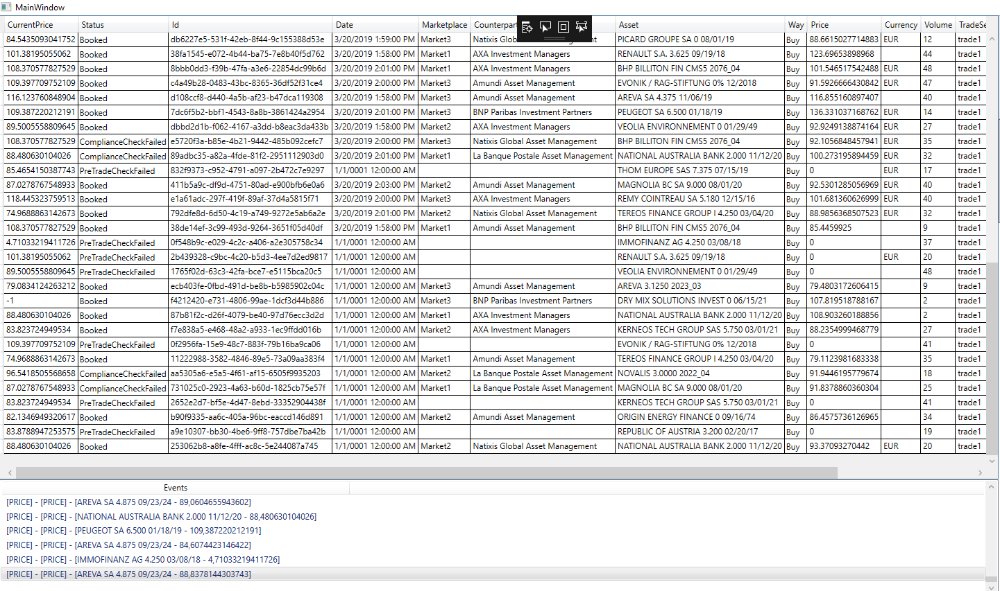
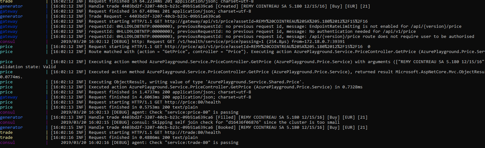
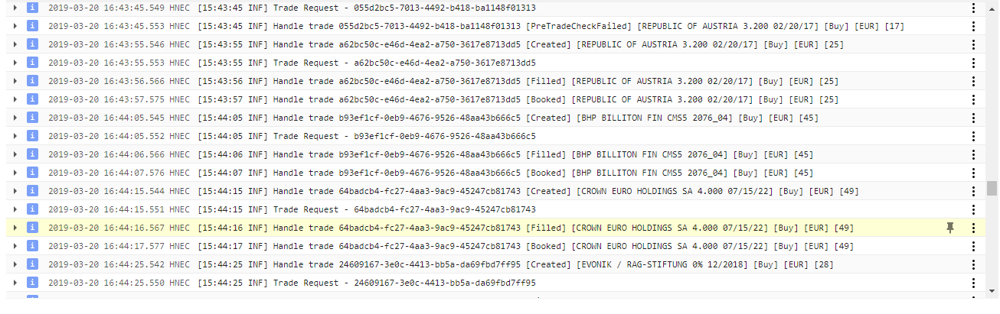

# AzurePlayground

This is a lab around kubernetes.

The application is composed of an openid server ([IdentityServer4](https://github.com/IdentityServer/IdentityServer4)), a gateway ([Ocelot](https://github.com/ThreeMammals/Ocelot)) with an active auto registration feature using [Consul](https://github.com/hashicorp/consul), and [EventStore](https://github.com/EventStore/EventStore) as the backend and service bus. SignalR is used for external messaging.

The application loosely simulate the lifecyle of a trade in a CIB, in a CQRS and micro-service pattern.

Each trade state (creation, rejection, counterparty filled, compliance check etc...) is an event and the trade itself is an aggregation of events, handled with EventStore. The "business" services include a trade service which handle the trade creation and access to the trade repository, a market service which provide a price and a counterparty to the newly created trade (and also run a SignalR service simulating a price feed), a compliance service which evaluate the trade regulatory status and handle the booking, and a trade event service which propagate the trade status to remote applications, also via SignalR.

All the services are reached through an Ocelot gateway and require authentication, provided by an authentication service via openid, using IdentityServer4.

You can either run the application in debug, via docker-compose or on a local/remote kubernetes cluster.

The web and desktop GUI are only available in debug mode (a trade generator provide a background "business" activity, even if no GUI is active). It is possible to use them if hosted on a cluster, either remote or local, but would require to set up the application, first running the service layer and then providing the presentation layers with the relevant services IP/DNS names (authentication and gateway, openid clients callbacks...), which would make things quite cumbersome for the demo to run.

On windows:

### Debug :

	**Build:**
		- ./debug/debug-build-local.cmd --> Run a debug build for all the VS projects
	**Run:**
		- ./debug/debug-run.cmd --> Run all projects and the relevant docker services
		- Run the WPF gui in VS or go to http://localhost:5002, login as user: alice.smith, password : alice
	**Stop:**
		- ./debug/debug-stop.cmd

# 

### Docker compose:
	
	**Build:**
		- ./build/docker-build-local.cmd --> Publish the VS projects and bundle them in the relevants docker images  
	**Run:**
		- ./build/docker-start.cmd --> Run the application via compose
	**Stop:**
		- ./build/docker-stop.cmd

# 

### Kubernetes :
	
	**Build:**
		- ./docker-build-local.cmd --> Publish the VS projects and bundle them in the relevants docker images
		- Push the images to the docker registry your kubectl is wired to
	**Run:**
		- kubectl create -f ./deploy/k8s/services.yaml
		- kubectl create -f ./deploy/k8s/deployments.yaml
	**Stop:**
		- kubectl delete -f ./deploy/k8s/deployments.yaml
		- kubectl delete -f ./deploy/k8s/services.yaml

# 

